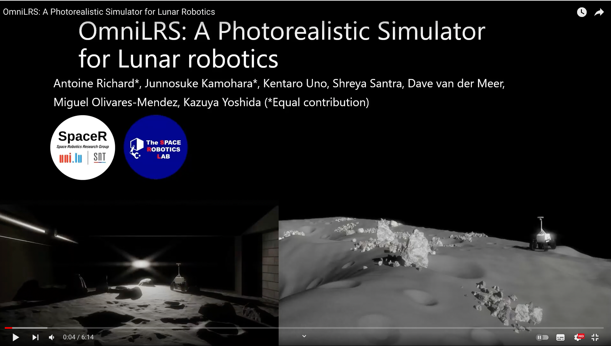
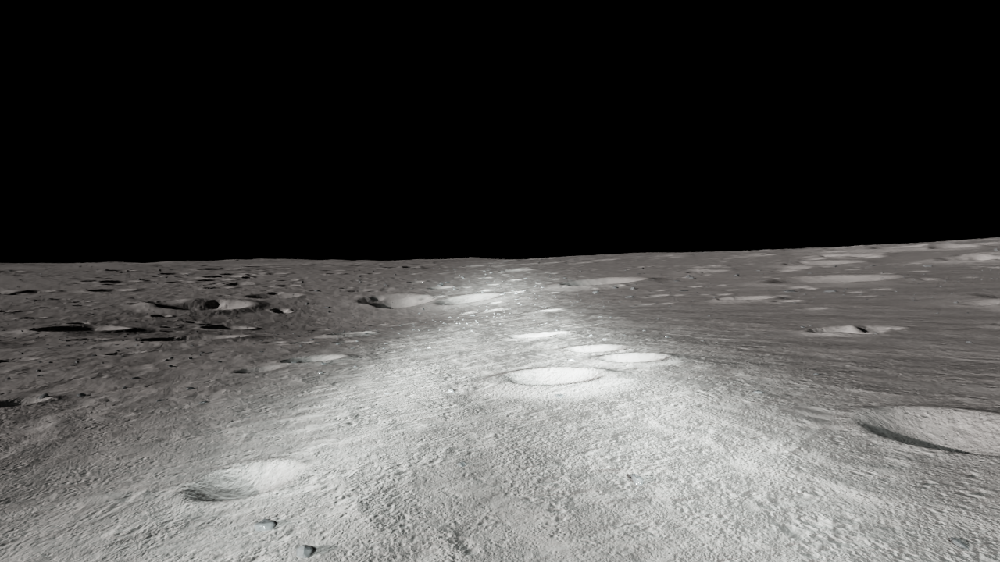

# OmniLRS v2.0

In this repository, you will find the tools developped jointly by the Space Robotics group from the University of Luxembourg (SpaceR),
and the Space Robotics Lab from Tohoku University in Japan (SRL).

Please refer to the following presentation video and [slide](https://drive.google.com/file/d/1vIf3sHbgJz4mbKpPGAQFcx8JtvYv5YKp/view?usp=sharing) for the overview of our work.
<div align="center">
      <a href="https://youtu.be/PebUZjm0WuA?si=hb-BivXSh4xw7Mqq">
         
      </a>
</div>

> Please note that this is only a partial release. The entirety of the code and assets/robots will be released at a later date.
> We will also provide docker as well as Foxglove interfaces to ease the interaction with the simulation.
> Should you run into any bug, or would like to have a new feature, feel free to open an issue.

With this initial release we provide our small scale environments:
 - The lunalab 
 - The lunaryard (3 versions 20m, 40m, 80m)

| Environment| Description | Image            |
|------------|-------------|---------------------------------|
| **Lunalab**            | Digital-Twin of lunar analog at the University of Luxembourg. |  |
| **Lunaryard**            | Procedually generated lunar environment. |  |
| **LargeScale**           | Semi procedural lunar environment. | 

We also provide 3 operation modes:
 - ROS1: allows to run ROS1 enabled robots
 - ROS2: allows to run ROS2 enabled robots
 - SDG: or Synthetic Data Generarion, allows to capture synthetic data to train neural-networks.

For ROS2 we prepared 5 different robots:
 - EX1 (`ex1.usd`): SRL's own rover.
 - Leo Rover (`Leo_rover.usd`): a rover from fictionlab used by SpaceR.
 - Husky (`husky.usd`): the UGV from Clearpath Robotics.
 - Jackal (`jackal.usd`): the UGV from Clearpath Robotics.
 - Turtlebot (`turtlebot3.usd`): A popular educational robot.

Finally, we provide simple configurations for different renderers:
 - path_tracing: A slower rendering method that provides realistic light bounces.
 - ray_tracing: A fast rendering method that does not provide pitched back shadows.


## Installation

In this page we'll walk you through the installation process of our simulation. Since our simulation is built on top of Isaac, you will need an Nvidia GPU to run it.

Hardware requirement:
- An Nvidia GPU:
  - with 8+ Gb of VRAM (some scene will work on 4Gb)
  - RTX Series 2000 or above.
- A recent 12+ threads CPU.
- 32Gb of RAM. (for some scene 16Gb is enough)
- 10+ Gb of free space.

Operating System:
- Linux distros similar to Ubuntu 20.04 or 22.04.

> Windows is not supported.

To install the simulation we strongly suggest using docker. Though the install could also be done using a native installation.

### Native installation

The first thing that needs to be done before we proceed with the native installation is to install Isaac. We support two version 2023.1.1 and 4.1.0. Though we'd recommend sticking to **2023.1.1** as there are some issues with renderings in 4.1.0.

[How to install Isaac?](https://docs.omniverse.nvidia.com/isaacsim/latest/installation/install_workstation.html)

To simplify the installation process of the framework we provide an script that will automatically download all the assets, as well as install the required dependencies.

```bash
scripts/install.sh
```

If you'd rather do it yourself, here are the commands:
```bash
# Pulls WorldBuilder
git submodule init
git submodule update

# Install GDAL
sudo apt-get install gdal-bin
sudo apt-get install libgdal-dev
version=$(gdal-config --version)

# Install Python packages for Isaac Sim
~/.local/share/ov/pkg/isaac_sim-2023.1.1/python.sh -m pip install opencv-python omegaconf hydra-core skyfield gdal==$version zfpy, gdown, black, numba

# Download the assets from Google Drive
gdown 1LfdJ8cogFU8Eid2EL-0bu9E383lftC_W 
unzip assets_v6.zip
rm assets.zip

# Download the DEMs of the lunar southpole and format them.
./scripts/get_dems.sh
./scripts/extract_dems_override.sh
# Get Ephemeris data
./scripts/get_ephemeris_data.sh
```

Once this is done you should be off to the races!
See [getting started](GettingStarted) to learn more about starting your first scene.

### Docker Install

Before we install the simulation, please follow the procedure [here](https://docs.omniverse.nvidia.com/isaacsim/latest/installation/install_container.html) to install all the required components. Once you're all set, the following to build the image:
```
./docker/build.sh
```

Once the image is built you should all set to run your first scene.
See [getting started](GettingStarted) to learn more about starting the simulation.


## Getting started:

If you are using docker, first run the container by using:
```bash
./docker/run_docker.sh
```

You can then run the commands inside the docker, as if you were using the native installation. To run isaac prefix `python.sh` by `/isaac-sim/` in docker, and `~/.local/share/ov/pkg/isaac_sim-2023.1.1/` in the native installation.

Run your first scene using:
```bash
python.sh run.py
```
This will launch a lunalab environment with ROS2 and ray_traced rendering.

You can run the lunaryard by using:
```bash
python.sh run.py environment=lunaryard
```

You can run the largescale environment by using:
```bash
python.sh run.py environment=largescale
```

To learn more about how to run scenes please refere to the Wiki [here](https://github.com/AntoineRichard/OmniLRS/wiki/Configuration)!

## ROS interactions with the scene

A complete description of the interactions available with the sim from ROS are available on the Wiki [here](https://github.com/AntoineRichard/OmniLRS/wiki/ros_topics).

## ROS2 demo
We prepared another separate git repository to run ROS2 demo. \
It supports joystick teleoperation and navigation for now. \
https://github.com/jnskkmhr/omnilrs_ros2_demo


## Citation
Please use the following citation if you use `OmniLRS` in your work.
```bibtex
@article{richard2024omnilrs,
  title={OmniLRS: A Photorealistic Simulator for Lunar Robotics},
  author={Richard, Antoine and Kamohara, Junnosuke and Uno, Kentaro and Santra, Shreya and van der Meer, Dave and Olivares-Mendez, Miguel and Yoshida, Kazuya},
  booktitle={2024 IEEE International Conference on Robotics and Automation (ICRA)},
  url={https://arxiv.org/abs/2309.08997},
  year={2024}
}
```

## Directory Structure
```bash
.
├── assets
├── cfg
│   ├── environment
│   ├── mode
│   └── rendering
├── src
│   ├── configurations
│   ├── environments
│   ├── environments_wrappers
│   │   ├── ros1
│   │   ├── ros2
│   │   └── sdg
│   ├── labeling
│   ├── robots
│   ├── ros
│   └── terrain_management
└── WorldBuilders
```
