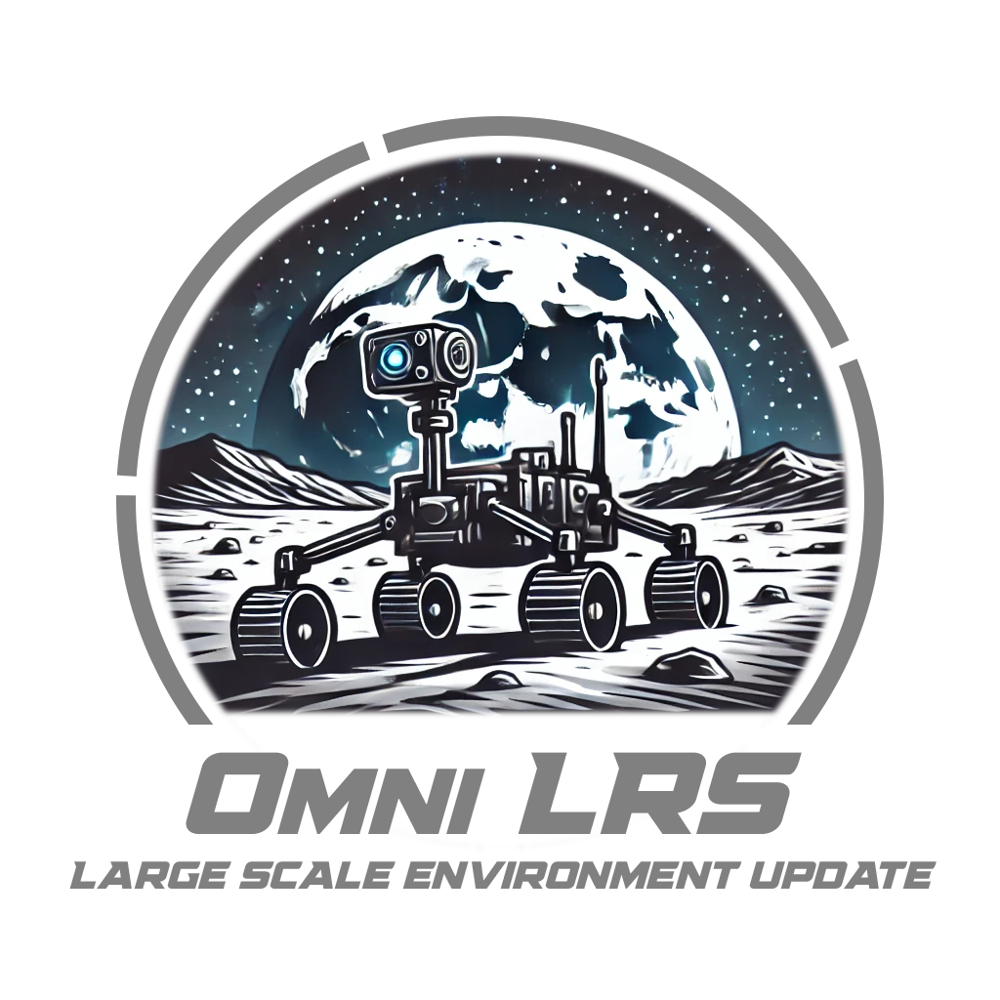

<center>

</center>

Omniverse Lunar Robotics Simulator or OmniLRS, is a simulation tools developped jointly by the Space Robotics group from the University of Luxembourg (SpaceR),
and the Space Robotics Lab from Tohoku University in Japan (SRL). We are now opening it to the community and strongly encourage Space Roboticists to help us grow the feature set of this simulation! Don't be shy shoot a PR!

> [!IMPORTANT]
> This readme provides basic information on how to use the simulation. For a more complete introduction to the simulation and its inner workings please [visit our wiki](https://github.com/AntoineRichard/OmniLRS/wiki)! For specific questions or to have a chat join [our discord](https://discord.gg/KfZ2uaMHqh)!

## Integration & Workflow with SpaceROS
> [!IMPORTANT]
> Isaac Sim is using ROS2 by default, most of the tools available in Isaac are meant for ROS2. Hence, this simulation uses ROS2. To use this simulation with SpaceROS, the ROS2 simulation docker must first be spinned up, and then in a second time, another container running SpaceROS must be launched to interact with the simulation.
> To illustrate this, we provide a simple teleop demonstration with the sim in ROS2 and SpaceROS sending velocity commands.
> Check the Wiki for a [step-by-step guide](https://github.com/AntoineRichard/OmniLRS/wiki#run-with-spaceros) on how to run this demo.

## Simulation Environments Overview


|  <div style="width:70px">Name</div>  |  <div style="width:230px">Description</div>  | Images            |
|------------|-------------|---------------------------------|
| **Lunalab**            |  <div style="width:230px"> Digital-Twin of lunar analog at the University of Luxembourg. This environment also supports terrain deformation as the rover drives on it. </div> |  |
| **Lunaryard**            |  <div style="width:230px">A small scale procedually generated lunar environment. If lunar coordinates and a date is provided the position of the earth and sun are computed using ephemerides resulting in realistic lighting. This feature is also available in the large scale environments. This environment also support terrain deformation as the rover drives on it.</div>  |  |
| **LargeScale**           |  <div style="width:230px">Semi procedural lunar environment. It uses real DEM to reconstuct the coarse terrain, usually 5meters per pixel and then uses procedural generation to augment it to 2.5cm per pixel. The terrain itself can be generated at a even higher resolution to smooth out shadows. This very fine terrain allows to reconstruct fine terrain features increasing the engineering value of the sim. The whole of this is bundled inside Geometry clip maps, allowing to render very large scenes.</div> | 

> [!NOTE]
> Please note that this is a partial release. More robots will be made available at a later date. Should you run into a bug, or would like to request a new feature, feel free to open an issue. Want to collaborate, reach out to us!

## OmniLRS in action!

First release:

[](https://www.youtube.com/watch?v=PebUZjm0WuA)

Wheel traces:

[](https://www.youtube.com/watch?v=TpzD0h-5hv4)

Large Scale update:

[](https://www.youtube.com/watch?v=3m78fO5uXwA)


## Installation

In this page we'll walk you through the installation process of our simulation. Since our simulation is built on top of Isaac, you will need an Nvidia GPU to run it.

Hardware requirement:
- An Nvidia GPU:
  - with 8+ Gb of VRAM (some scene will work on 4Gb)
  - RTX Series 2000 or above.
- A recent 12+ threads CPU.
- 32Gb of RAM. (for some scene 16Gb is enough)
- 10+ Gb of free space.

Operating System:
- Linux distros similar to Ubuntu 20.04 or 22.04.

> [!WARNING]
> Windows is not supported.

To install the simulation we strongly suggest using [docker](#docker-install). Though the install could also be done using a [native installation](#native-installation).

### Native installation

The first thing that needs to be done before we proceed with the native installation is to install Isaac. We support two version 2023.1.1 and 4.1.0. Though we'd recommend sticking to **2023.1.1** as there are some issues with renderings in 4.1.0. Our dockers currently come in the 2023.1.1 version of Isaac.

> [!TIP]
> If you're unsure on how to install Isaac sim, look-up the following: [How to install Isaac Sim.](https://docs.omniverse.nvidia.com/isaacsim/latest/installation/install_workstation.html)

To simplify the remainder of the installation process of the framework we provide a script that will automatically download all the assets, as well as install the required dependencies. It will not install Isaac Sim.
> [!IMPORTANT]
> Run this command at the root of the repository. 

```bash
./scripts/install_native.sh
```

To install for IsaacSim 4.1.0

```bash
./script/install_native.sh -v
```


If you'd rather do it yourself, here are the commands for IsaacSim 2023.1.1:
```bash
# Pulls WorldBuilder
git submodule init
git submodule update

# Install GDAL
sudo apt-get install gdal-bin
sudo apt-get install libgdal-dev
version=$(gdal-config --version)

# Install Python packages for Isaac Sim
~/.local/share/ov/pkg/isaac-sim-2023.1.1/python.sh -m pip install opencv-python omegaconf hydra-core skyfield gdal==$version zfpy numba empy
# If this does not work for you, you maybe running an older version of IsaacSim 2023.1.1, try running the following:
# ~/.local/share/ov/pkg/isaac_sim-2023.1.1/python.sh -m pip install opencv-python omegaconf hydra-core skyfield gdal==$version zfpy numba empy

python3 -m pip install --upgrade pip
python3 -m pip instal gdal==$version gdown black

# Download the assets from Google Drive
gdown 1XuFlDRELPQmjJFLP1E54IOhRiFn5iM_7
unzip assets_v6.zip
rm assets_v6.zip
gdown 1sXrsT7ZdA3VslMREBtjo6-Ou1-v8-8dI
unzip lunar_rocks.zip -d assets/USD_Assets/rocks
rm lunar_rocks.zip

# Download the DEMs of the lunar southpole and format them. This can take a long time.
./scripts/get_dems.sh
./scripts/extract_dems_override.sh
# Get Ephemeris data
./scripts/get_ephemeris_data.sh
```

For Isaac Sim 4.1.0, the python environment pre-installed numpy is incompatible with OmniLRS so it needs to be downgraded to 1.22.0. You also need to install lark package:

```bash
# Similar process with IsaacSim 2023.1.1 until Python packages installation

# Install Python packages for Isaac Sim
~/.local/share/ov/pkg/isaac-sim-4.1.0/python.sh -m pip install opencv-python omegaconf hydra-core skyfield gdal==$version zfpy numba empy lark
~/.local/share/ov/pkg/isaac-sim-4.1.0/python.sh -m pip install --upgrade numpy==1.22.0
python3 -m pip install --upgrade pip
python3 -m pip instal gdal==$version gdown black

# Continue with asset downloads
```


Once this is done you should be off to the races!
However, before you venture forward, check that the assets folder has been created with success.
It should contain the following:
```bash
├── assets
│   ├── Ephemeris
│   ├── Terrains
│   |   ├── Lunalab
│   |   ├── Lunaryard
│   |   └── SouthPole
│   ├── Textures
│   └── USD_Assets
│       ├── common
│       ├── environments
│       ├── lunalab
│       ├── robots
│       └── rocks
```
See [getting started](#getting-started) to learn more about starting your first scene.

### Docker Installation

Before we install the simulation, please follow the procedure [here](https://docs.omniverse.nvidia.com/isaacsim/latest/installation/install_container.html) to install all the required components to install IsaacSim in a docker container.

> [!TIP]
> You will need an [nvcr.io](https://catalog.ngc.nvidia.com/) account.

Once you're all set, use following to build the image:
```bash
./omnilrs.docker/build_docker.sh
```

Once the image is built the simulation should be ready to go.
Though you will still need to download the assets. If you want to, you can download them from docker directly.

First pull the submodule
```bash
# Pulls WorldBuilder
git submodule init
git submodule update
```
Then start the docker
```bash
./omnilrs.docker/run_docker.sh
```
And run the script in the docker:
```bash
scritps/install_docker.sh
```
This will download the assets from docker and it should work fine. The issue is that all the generated folder will be
owned by root. So you may want to change that afterwards by running:
```bash
chown -R $USER assets
chgrp -R $USER assets
```

Provided you have Gdal and gdown installed on your system, you can also run:
```bash
scripts/download_only_native.sh
```

See [getting started](#getting-started) to learn more about starting the simulation.


## Getting started:
> [!CAUTION]
> The following assumes you are running ROS2/SpaceROS. While the code has ROS1 compatibility, we do not provide base configs or robots for ROS1.

> [!CAUTION]
> If you are using native ROS2 please follow the ROS2 installation process in particular [this part](https://docs.omniverse.nvidia.com/isaacsim/latest/installation/install_ros.html#enabling-the-ros-bridge-extension)
> Make sure Nucleus is running.

> [!IMPORTANT]
>If you are using docker, first run the container by using:
```bash
./omnilrs.docker/run_docker.sh
```

> [!IMPORTANT]
> If you are using the native installation, make sure ROS2 is sourced **before running the simulation**.

You can then run the commands inside the docker, as if you were using the native installation. To run isaac prefix `python.sh` by `/isaac-sim/` in docker, and `~/.local/share/ov/pkg/isaac_sim-2023.1.1/` in the native installation. Before 

Run your first scene using:
```bash
python.sh run.py
```
This will launch a lunalab environment with ROS2 and ray_traced rendering.

You can run the lunaryard by using:
```bash
python.sh run.py environment=lunaryard_20m
```

You can run the largescale environment by using:
```bash
python.sh run.py environment=largescale
```

> [!TIP]
> To learn more about how to run scenes please refere to the Wiki [here](https://github.com/AntoineRichard/OmniLRS/wiki/Configuration)!

## ROS interactions with the scene

The simulation allows user to interact with the Scene through ROS topics. This allows for instance to reset or teleport a robot, or to change the intensity of a light!

We provide a complete description of the interactions available with the sim from ROS on the Wiki [here](https://github.com/AntoineRichard/OmniLRS/wiki/ros_topics).

## ROS2 demo
We've prepared another separate git repository to run ROS2 demo. \
It supports joystick teleoperation and navigation for now. \
https://github.com/jnskkmhr/omnilrs_ros2_demo


## Citation
Please use the following citations if you use `OmniLRS` in your work.
```bibtex
@article{richard2024omnilrs,
  title={OmniLRS: A Photorealistic Simulator for Lunar Robotics},
  author={Richard, Antoine and Kamohara, Junnosuke and Uno, Kentaro and Santra, Shreya and van der Meer, Dave and Olivares-Mendez, Miguel and Yoshida, Kazuya},
  booktitle={2024 IEEE International Conference on Robotics and Automation (ICRA)},
  url={https://arxiv.org/abs/2309.08997},
  year={2024}
}

@article{kamohara2024modelingterraindeformationgrouser,
      title={Modeling of Terrain Deformation by a Grouser Wheel for Lunar Rover Simulation}, 
      author={Junnosuke Kamohara and Vinicius Ares and James Hurrell and Keisuke Takehana and Antoine Richard and Shreya Santra and Kentaro Uno and Eric Rohmer and Kazuya Yoshida},
      year={2024},
      eprint={2408.13468},
      booktitle={21st International and 12th Asia-Pacific Regional Conference of the ISTVS}
      primaryClass={cs.RO},
      url={https://arxiv.org/abs/2408.13468}, 
}
```

## Directory Structure
```bash
.
├── assets
├── cfg
│   ├── environment
│   ├── mode
│   └── rendering
├── src
│   ├── configurations
│   ├── environments
│   ├── environments_wrappers
│   │   ├── ros1
│   │   ├── ros2
│   │   └── sdg
│   ├── labeling
│   ├── robots
│   ├── ros
│   └── terrain_management
└── WorldBuilders
```
