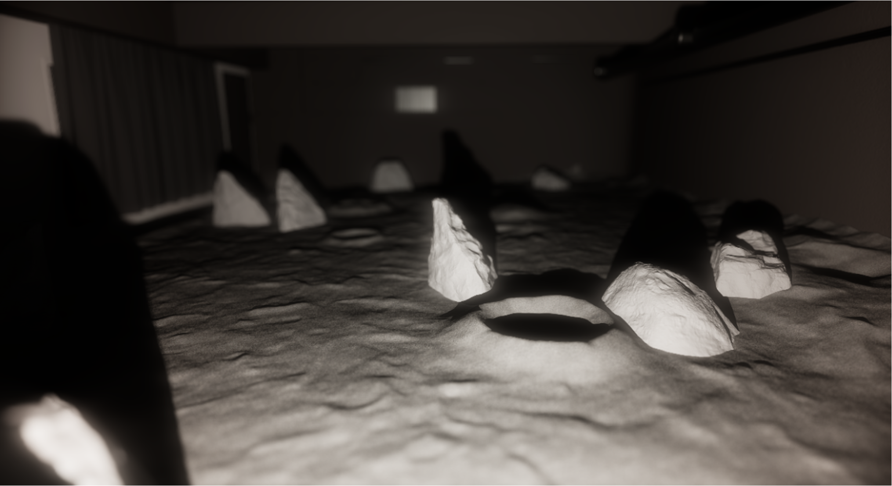
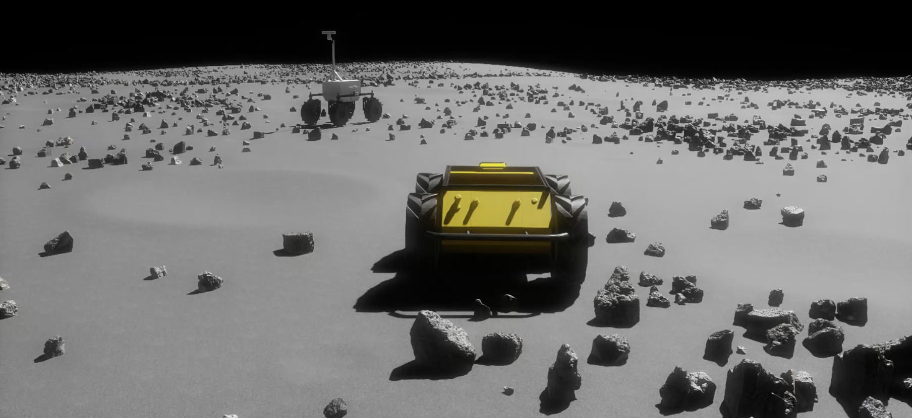

## Environments \& Configs

In the following we go through the different environments as well as the settings that can be used to tune them.
Here is the list of default environments that can be generated:
- The [Lunalab](#lunalab), an digital twin of the lunalab at the university of Luxembourg.
- The [lunaryard](#lunaryard), a small procedural environment meant for basic testing.
- The [large_scale](#largescale), a large scale semi-procedural environment meant for full fledged tests.

Upcoming environments:
- The `rover_scape` from NASA Ames, at the NASA ARC, CA, USA.
- The `the_moon_rostock` from PTS space in Rostock's Airport, Germany.
- The `confined_large_scale`, a visually large environment that allows for terrain deformation.

All the configurations are using [hydra](https://hydra.cc/docs/intro/) a configuration manager. 

### Lunalab

The `lunalab` environment is a replica of the Lunalab [1] from the University of Luxembourg. This 10.0 by 6.5 meter
environment allows to test rovers at the uni of luxembourg. The ground is made of small basalt rocks, and can be used
to perform small scale tests prior to large scale testing in analog environments. This environment was modeled in
blender and provides 2 terrain that were scanned using a total station.




Environment arguments:
- `resolution`: `(float)` the resolution of the terrain mesh in meters. Typically within \(0.01 and 0.05\)

The lunaryard can be futher customized by using one of the following objects:
- [Rock Generator](#extras-rocks), an object that can spawn rocks on the generated terrain.
- [Terrain Generator](#extras-terrain)

A complete example is available in the environment config.

### Lunaryard

The `lunaryard` is a procedural small scale environment (from 10 to 80 meters) meant to perform simple tests with
different algorithms. It's simplicity means it will easily run on most machines and will allow to perform basic
debugging steps.



Environment arguments:


The lunaryard can be futher customized by using one of the following objects:
- [Stellar Engine](#extra-sun), an object allowing to move the earth and sun based on the current time and coordinates on the moon.
- [Rock Generator](#extras-rocks), an object that can spawn rocks on the generated terrain.
- [Terrain Generator](#extras-terrain)

A complete example is available in the environment config.

### LargeScale

The `large_scale` environment is meant to fully test navigation and mapping algorithms. It offers the ability to perform
very long traverses (20km+) while maintaining a locally very high resolution terrain mesh. This environment is a lot
more resource intensive than the others, be it on the CPU, RAM, GPU, and VRAM.


A complete example is available in the environment config.

## Extras: Light Sources

In the following we detail how the sun can be customized. This argument is only applicable to "open space" environments such as the [LargeScale](#largescale) and [Lunaryard](#lunaryard).

### Sun

This allows to customize the default parameters for the Sun in the [LargeScale](#largescale) and [Lunaryard](#lunaryard) environments.

Parameters:
- `intensity`: `(float)`, The intensity of the sun light. The higher the value, the brighter the scene will be.
- `angle`: `(float)`, The angle of the sun light in degrees. Note that this denotes the size of the sun in sky, not its azimuth or elevation. The larger the angle, the bigger the sun will appear.
- `diffuse_multiplier`: `(float)`, A multiplier for the effect of the sun has on the diffuse response of materials. It can be used to create stronger flares by setting this value to 0.1 and multiplying the light intensity by 10.
- `specular_multiplier`: `(float)`, A multiplier for the effect the sun has on the specular response of materials. It can be used to create stronger flares by setting this value to 0.1 and multiplying the light intensity by 10.
- `color`: `((float, float, float))`, The color to be given to the light. Format is (R,G,B), with 0.0 <= R,G,B <= 1.0.
- `temperature`: `(float)`, The temperature of the light source in Kelvin.
- `azimuth`: `(float)`, The azimuth of the sun in degrees. If the [Stellar Engine](#stellar-engine) is enabled it will override this parameter.
- `elevation`: `(float)`, The elevation of the sun in degrees. If the [Stellar Engine](#stellar-engine) is enabled it will override this parameter.

Example:
```yaml
```

### Coordinates

This allows to set the coordinates of the [Lunaryard](#lunaryard) environment. The coordinate is used by the [Stellar Engine](#stellar-engine) to compute the position of the sun and earth for a given date.

Parameters:
- `latitude`: `(float)`, The latitude of the environment in degrees.
- `longitude`: `(float)`, The longitude of the environment in degrees.

Example:
```yaml
coordinates:
  latitude: 46.8
  longitude: -26.3
```

### Date

This allows to set the date of the [LargeScale](#largescale) and [Lunaryard](#lunaryard) environments. The date is used by the [Stellar Engine](#stellar-engine) to compute the position of the sun and earth for a given coordinate on the moon.

Parameters:
- `year`: `(int)`, The year.
- `month`: `(int)`, The month.
- `day`: `(int)`, The day.
- `hour`: `(int)`, The hour.
- `minute`: `(int)`, The minute.

Example:
```yaml
start_date:
  year: 2024
  month: 5
  day: 1
  hour: 12
  minute: 50
```
Used inside the [Stellar Engine](#stellar-engine)'s configuration.

### Stellar Engine

The Stellar uses both the [Date](#date) and the [Coordinates](#coordinates) to estimate the position of the sun and earth in the lunar sky.

<span style="color: red;">**Known limitations**:</span> We use [skyfield] to compute the position of the earth and sun. This python library does not support well multi-segment ephemeris. Hence we recommend to use the ones provided with the sim.

Parameters:
- `start_date`: `(Date)`, a date as defined in [Date](#date-configuration).
- `time_scale`: `(float)`, a time multiplier that allows to make time pass faster of slower.
- `update_interval`: `(float)`, the amount of scaled time that must pass for the position of the stellar bodies to be updated.
- `distance_scale`: `(float)`, the scaling factor to be applied to the distance between the center of the scene and the earth. A value below 1 will lead to the distance being reduced.
- `ephemeris_path`: `(str)`, the path to the ephemeris data.
- `ephemeris`: `(str)`, the name of the ephemeris.
- `moon_pa`: `(str)`, the name of the "spice binary lunar pck".
- `moon_tf`: `(str)`, the name of the "frame kernel".
- `pck`: `(str)`, the name of the "pck".
- `frame`: `(str)`, the name of the frame to be used.

Example:
```yaml
stellar_engine_settings:
  start_date:
    year: 2024
    month: 5
    day: 1
    hour: 12
    minute: 50
  time_scale: 1
  update_interval: 600
  distance_scale: 0.001
  ephemeris_path: assets/Ephemeris
  ephemeris: de421.bsp
  moon_pa: moon_pa_de421_1900-2050.bpc
  moon_tf: moon_080317.tf
  pck: pck00008.tpc
  frame: MOON_ME_DE421
```

## Extras: Rocks

In this section we provide some details regarding the distribution of rocks in the scene. This is only applicable to small scale environments such as the [Lunalab](#lunalab) or the [Lunaryard](#lunaryard). Large scale environments rely on different methods to generate and manage rocks.

To generate rocks we rely 3 different objects. The base block is a [request](#request), it assigns a type of parameter to be randomized with a given distribution. A [group of requests](#request-group), that is a bundle of requests. And finally a [rock generation configuration](#rock-generation).
How to set up these is explained below:
- [request](#request)
- [request group](#request-group)
- [rock generation configuration](#rock-generation)

### Request
A request allows to set a given parameter of the rocks to be randomized. As of now, we only randomize so called `xformOp`s. These are a set of geometric transformation that control the scale, rotation, and translation of assets in OpenUSD. A request applies a statistical distribution, like a `uniform` distribution on a geometric primitive, or a digital elevation map. The axes on which the randomization should be applied can also be selected.

Parameters:
- `attribute`: `(str)`, The name of the attribute to be randomized. Can be `Scale`, `Orientation`, or `Position`.
- `axes`: `(list)`, The axis of the selected attribute to be randomized. A list containing `x`, `y`, `z`, `w`. Note that the orientation is always defined as a quaternion. Aggregating multiple dimmensions i.e. writing `xyz` means that the values for `x` `y` and `z` will be the same.
- `num`: `(int)`, The number of points to be generated. If there is a PointProcess, or a ClusterPointProcess inside the same [request group](#request-group) this parameter should not be set. If there is none, it should be similar for all requests within the same [request group](#request-group).
- `inherit_parents`: `(bool)`, If the distribution has a parent distribution. This is only applicable to "ClusterPointProcesses" kind of distributions.
- `layer`: `str`, the layer object to sample on. More info is given [here](#request-layers).
- `sampler`: `str`, the sampler object to sample from. More info is given [here](#request-samplers)

Examples:

Single request, that scales the x y an z dimensions similarly. The values range from 0.01 to 0.05 and the distribution used is a uniform distribution.
```yaml
req_scale:
  attribute: Scale
  axes: ["xyz"]
  num: 1000
  inherit_parents: False
  layer:
    name: Line
      xmin: 0.01
      xmax: 0.05
  sampler:
    name: Uniform
    randomization_space: 1
    seed: 42
```

Single request where the orientation is sampled for a given axis. Here the yaw is randomized.
```yaml
req_random_z_rot:
  attribute: Orientation
  axes: ["x", "y", "z", "w"]
  layer:
    name: RollPitchYaw
    rmax: 0
    rmin: 0
    pmax: 0
    pmin: 0
    ymax: 6.28318530718
    ymin: 0
  sampler:
    name: Uniform
    randomization_space: 3
    seed: 42
```

### Request Group

A request group defines a bundle of requests to execute, the type of assets to be used, and whether of not we should use an instancer. 

Parameters:
- `seed`: `(int)`, the seed to be used.
- `collections`: `(str)`, the name of the folder in which the rocks are saved.
- `use_point_instancer`: `(bool)`, if the assets should be generated with an instancer or not. <span style="color: red;">**Limitations of instancers in isaac sim**:</span> they do not work well with semantic information. Hence, if you want to collect semantic data, do not use them!
- `parent`: `(str)`, to be set if another [request group](#request-group) if the parent of this one. Set to the name of that other [request group](#request-group).
- `requests`: `list[request]`, the list of requests to be executed.

Example:

A request group without parent.
```yaml
medium_rocks:
      seed: ${....seed}
      collections: ["apollo_rocks"] # Uses the apollo rocks inside assets/USD_Assets/rocks
      use_point_instancer: True # Set to True for fast sampling, set to False for SDG
      requests:
        req_pos_xy: # Sample XY position
          attribute: Position
          axes: ["x", "y"]
          layer:
            name: Image
            mpp_resolution: ${.......lunaryard_settings.resolution}
            output_space: 2
          sampler:
            name: ThomasCluster
            randomization_space: 2
            lambda_parent: 0.25
            lambda_daughter: 200
            sigma: 0.2
            seed: ${.......seed}

        req_pos_z: # Get Z from the elevation map.
          attribute: Position
          axes: ["z"]
          layer:
            name: Image
            output_space: 1
          sampler:
            name: Image
            randomization_space: 1
            mpp_resolution: ${.......lunaryard_settings.resolution}

        req_random_z_rot: # Randomize Z orientation
          attribute: Orientation
          axes: ["x", "y", "z", "w"]
          layer:
            name: RollPitchYaw
            rmax: 0
            rmin: 0
            pmax: 0
            pmin: 0
            ymax: 6.28318530718
            ymin: 0
          sampler:
            name: Uniform
            randomization_space: 3
            seed: ${.......seed}

        req_scale: # Randomize the scale homogeneously.
          attribute: Scale
          axes: ["xyz"]
          layer:
            name: Line
            xmin: 1.0
            xmax: 1.0
          sampler:
            name: Uniform
            randomization_space: 1
            seed: ${.......seed}
```


### Rock Generation

This aggregates multiple requests groups.

Parameters:
- `instancers_path`: `(str)`, The path where the instancers will be generated.
- `rocks_settings`: `(list(request_group))`, A list of request groups.

Example:
```yaml
rocks_settings:
  instancers_path: /Lunaryard/Rocks
  rocks_settings:
    medium_rocks:
      seed: ${....seed}
      collections: ["apollo_rocks"]
      use_point_instancer: True
      requests:
        req_pos_xy:
          attribute: Position
          axes: ["x", "y"]
          layer:
            name: Image
            mpp_resolution: ${.......lunaryard_settings.resolution}
            output_space: 2
          sampler:
            name: ThomasCluster
            randomization_space: 2
            lambda_parent: 0.25
            lambda_daughter: 200
            sigma: 0.2
            seed: ${.......seed}

        req_pos_z:
          attribute: Position
          axes: ["z"]
          layer:
            name: Image
            output_space: 1
          sampler:
            name: Image
            randomization_space: 1
            mpp_resolution: ${.......lunaryard_settings.resolution}

        req_random_z_rot:
          attribute: Orientation
          axes: ["x", "y", "z", "w"]
          layer:
            name: RollPitchYaw
            rmax: 0
            rmin: 0
            pmax: 0
            pmin: 0
            ymax: 6.28318530718
            ymin: 0
          sampler:
            name: Uniform
            randomization_space: 3
            seed: ${.......seed}

        req_scale:
          attribute: Scale
          axes: ["xyz"]
          layer:
            name: Line
            xmin: 1.0
            xmax: 1.0
          sampler:
            name: Uniform
            randomization_space: 1
            seed: ${.......seed}

    large_rocks:
      seed: ${....seed}
      collections: ["apollo_rocks"]
      use_point_instancer: True 
      parent: medium_rocks
      requests:
        req_pos_xy:
          attribute: Position
          axes: ["x", "y"]
          layer:
            name: Image
            mpp_resolution: ${.......lunaryard_settings.resolution}
            output_space: 2
          sampler:
            name: ThomasCluster
            randomization_space: 2
            lambda_parent: 0.25
            lambda_daughter: 5
            sigma: 0.05
            inherit_parents: True
            seed: ${.......seed}

        req_pos_z:
          attribute: Position
          axes: ["z"]
          layer:
            name: Image
            output_space: 1
          sampler:
            name: Image
            randomization_space: 1
            mpp_resolution: ${.......lunaryard_settings.resolution}

        req_random_z_rot:
          attribute: Orientation
          axes: ["x", "y", "z", "w"]
          layer:
            name: RollPitchYaw
            rmax: 0
            rmin: 0
            pmax: 0
            pmin: 0
            ymax: 6.28318530718
            ymin: 0
          sampler:
            name: Uniform
            randomization_space: 3
            seed: ${.......seed}

        req_scale:
          attribute: Scale
          axes: ["xyz"]
          layer:
            name: Line
            xmin: 2.0
            xmax: 5.0
          sampler:
            name: Uniform
            randomization_space: 1
            seed: ${.......seed}

    small_rocks:
      seed: ${....seed}
      collections: ["apollo_rocks"]
      use_point_instancer: True
      parent: medium_rocks
      requests:
        req_pos_xy:
          attribute: Position
          axes: ["x", "y"]
          layer:
            name: Image
            mpp_resolution: ${.......lunaryard_settings.resolution}
            output_space: 2
          sampler:
            name: ThomasCluster
            randomization_space: 2
            lambda_parent: 0.5
            lambda_daughter: 500
            sigma: 0.3
            inherit_parents: True
            seed: ${.......seed}

        req_pos_z:
          attribute: Position
          axes: ["z"]
          layer:
            name: Image
            output_space: 1
          sampler:
            name: Image
            randomization_space: 1
            mpp_resolution: ${.......lunaryard_settings.resolution}

        req_random_z_rot:
          attribute: Orientation
          axes: ["x", "y", "z", "w"]
          layer:
            name: RollPitchYaw
            rmax: 0
            rmin: 0
            pmax: 0
            pmin: 0
            ymax: 6.28318530718
            ymin: 0
          sampler:
            name: Uniform
            randomization_space: 3
            seed: ${.......seed}

        req_scale:
          attribute: Scale
          axes: ["xyz"]
          layer:
            name: Line
            xmin: 0.01
            xmax: 0.05
          sampler:
            name: Uniform
            randomization_space: 1
            seed: ${.......seed}
```