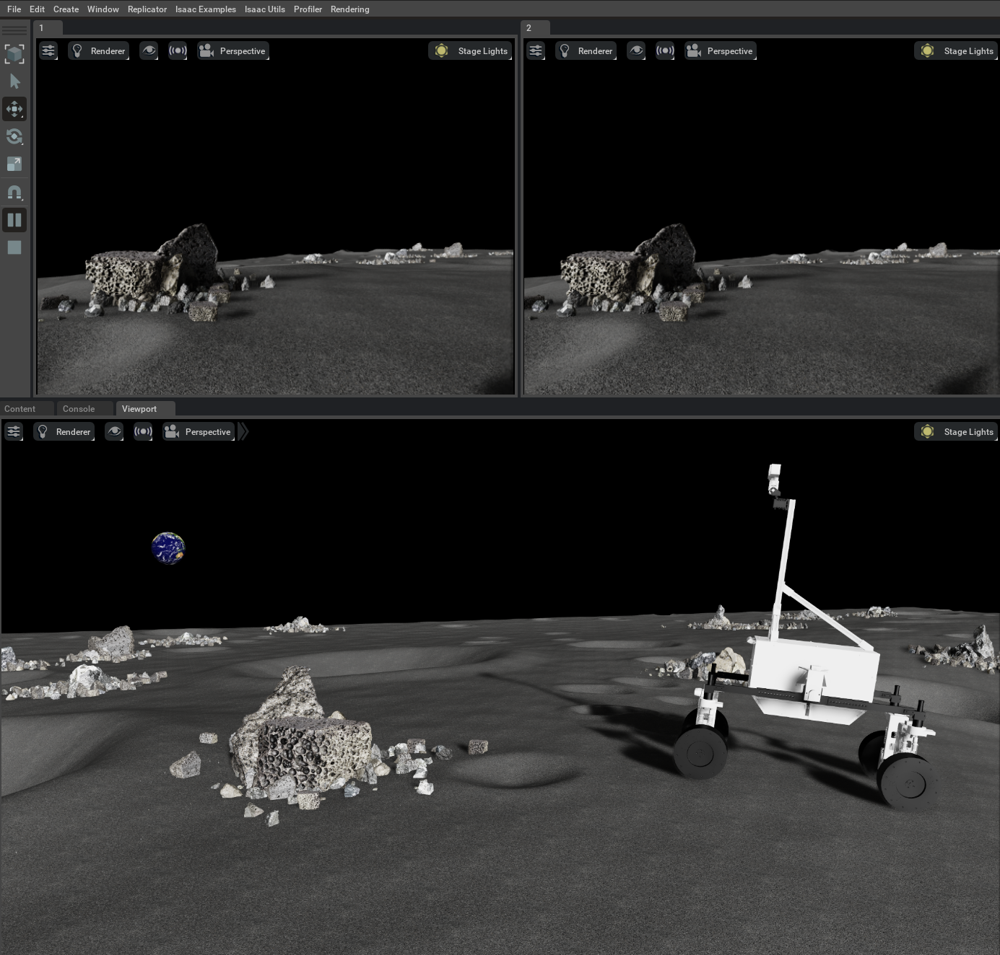
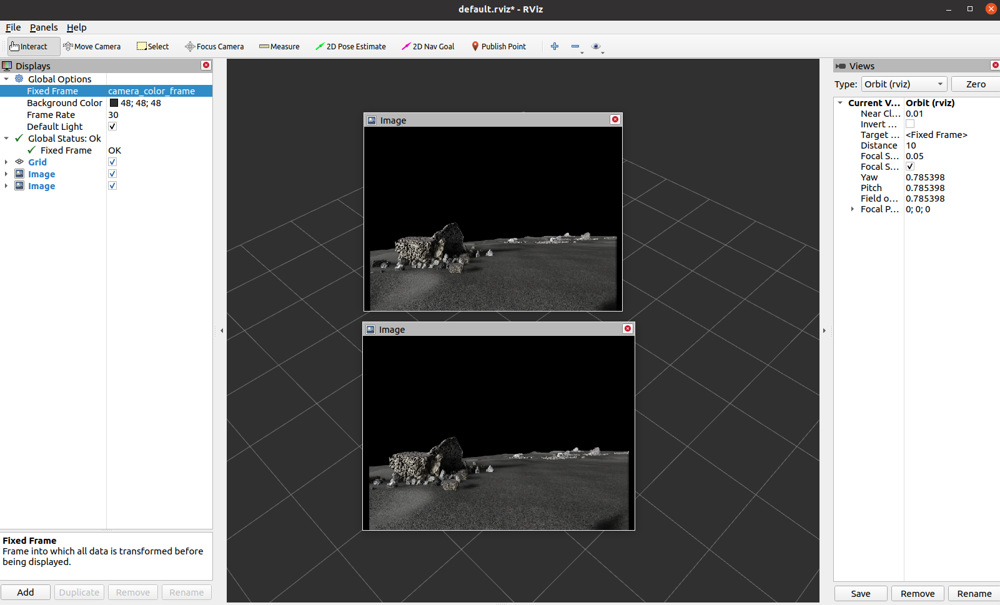

# Joystick teleoperation and stereo camera simulation




In this demo, we use EX1 rover from SRL. 
EX1 comes with four driving and steering motors. 
During operation, four driving and two front steering motors are controlled. 


Currently, we only suport ROS1, but ROS2 will also be available soon. 
First, clone ros package for joystick operation. 
```
cd {path/to/catkin_ws/src}
git clone git@github.com:jnskkmhr/omni_ex1_joy.git
cd ..
rosdep install --from-paths src -yi
catkin build
```

<details>
<summary>Joystick operation</summary>

```bash
# terminal 1
roslaunch omni_ex1_joy ex1_ackermann_teleop.launch
```

```bash
# terminal 2
cd ~/OmniLRS
~/.local/share/ov/pkg/isaac_sim-2022.2.1/python.sh run.py mode=ROS1 environment=lunaryard_20m rendering=ray_tracing
```
Note that this should be run after launching roscore

```
# terminal 3
rostopic pub -1 /Lunalab/Robots/Spawn geometry_msgs/PoseStamped '{header: {stamp: now, frame_id: "ex1:/home/lunar4/jnskkmhr/OmniLRS/assets/USD_Assets/robots/EX1_steer_ROS1.usd:0"}, pose: {position: {x: 10.0, y: 10.0, z: 0.5}, orientation: {x: 0.0, y: 0.0, z: 0.0, w: 1.0}}}'
```
Note that `frame_id: "ex1:/home/lunar4/jnskkmhr/OmniLRS/assets/USD_Assets/robots/EX1_steer_ROS1.usd:0"` correponsds to `robot_name:usd_path:domain_id`.
</details>

<details>
<summary>Joystick operation and stereo camera simulation</summary>

```bash
# terminal 1
roslaunch omni_ex1_joy ex1_ackermann_teleop.launch
```

```bash
# terminal 2
cd ~/OmniLRS
~/.local/share/ov/pkg/isaac_sim-2022.2.1/python.sh run.py mode=ROS1 environment=lunaryard_20m rendering=ray_tracing
```

```bash
# terminal 3
rostopic pub -1 /Lunalab/Robots/Spawn geometry_msgs/PoseStamped '{header: {stamp: now, frame_id: "ex1:/home/lunar4/jnskkmhr/OmniLRS/assets/USD_Assets/robots/EX1_steer_D435i_ROS1.usd:0"}, pose: {position: {x: 10.0, y: 10.0, z: 0.5}, orientation: {x: 0.0, y: 0.0, z: 0.0, w: 1.0}}}'
```
</details>

## Citation
EX1 rover is from the following paper.
```bibtex
@misc{2307.04494,
Author = {David Rodríguez-Martínez and Kentaro Uno and Kenta Sawa and Masahiro Uda and Gen Kudo and Gustavo Hernan Diaz and Ayumi Umemura and Shreya Santra and Kazuya Yoshida},
Title = {Enabling Faster Locomotion of Planetary Rovers with a Mechanically-Hybrid Suspension},
Year = {2023},
Eprint = {arXiv:2307.04494},
}
```