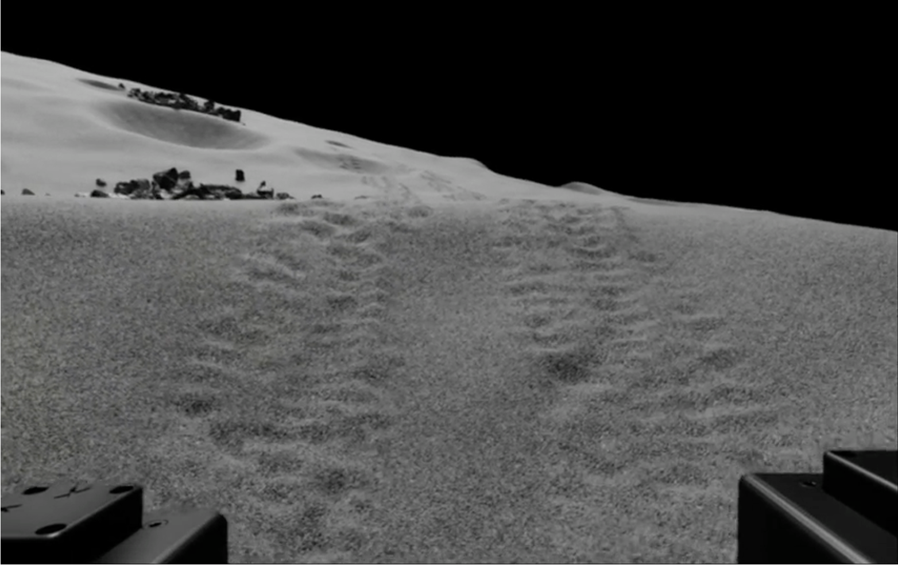

# Deformation Engine

<center>

</center>

Here, the docs gives a brief explanation of deformation engine plugin. \
In hydra cfg file (see `cfg/environment/**.yaml`), you have specific lines for terrain deformation. 

```yaml
deformation_engine:
    enable: True
    delay: 2.0 # how many frames to hold before you apply deformation
    terrain_width: ${....lunaryard_settings.lab_width}
    terrain_height: ${....lunaryard_settings.lab_length}
    terrain_resolution: ${....lunaryard_settings.resolution}
    num_links: 4 # num_robots * num_target_links
    footprint:
        width: 0.25
        height: 0.1
    deform_constrain:
        x_deform_offset: 0.0
        y_deform_offset: 0.0
        deform_decay_ratio: 0.01
    depth_distribution: 
        distribution: sinusoidal
        wave_frequency: 4.14 # num_grouser/pi (no slip)
    boundary_distribution: 
        distribution: trapezoidal
        angle_of_repose: 1.047 #pi/3
    force_depth_regression:
        amplitude_slope: 0.00006
        amplitude_intercept: 0.008
        mean_slope: -0.00046
        mean_intercept: -0.0013
```

## Footprint
This configuration specifies the dimensions of the robot's footprint. \
For now, we assume the footprint is rectangular since we are primarily focused on wheeled robots. \
Height and width correspond to the dimensions along the x and y axes (the robot's forward direction is along the x-axis).
```yaml
footprint:
    width: 0.25
    height: 0.1
```

### Deform Constraint
Here, you will specify the parameters for the constraint. \
`*_deform_offsest` refers to the distance between the projected wheel origin and the center of the deformation profile. \
`deform_decay_ratio` is the decay parameter for deformation. \
This is used to limit the deformation depth as the rover traverses the same location multiple times. \
Given the number of traversals $t$, the actual deformation value will be multiplied by scale factor $\text{ratio}^t$.
```yaml
deform_constrain:
    x_deform_offset: 0.0
    y_deform_offset: 0.0
    deform_decay_ratio: 0.01
```

## Depth Distribution 
This controls the xz distribution of the deformation profile.\
You have three options: uniform, sinusoidal, and trapezoidal.\
Typically, if your wheel has grousers, the wheel trace will exhibit a sinusoidal pattern.\
If your wheel has no grousers, the wheel trace is usually uniform.\
If the sand is cohesive, the trace tends to resemble a trapezoidal shape.

```yaml
force_distribution: 
    distribution: uniform
---
force_distribution: 
    distribution: sinusoidal
    wave_frequency: 2.0
---
force_distribution: 
    distribution: trapezoidal
    wave_frequency: 2.0
```

## Boundary Distribution
This controls the yz distribution of the deformation profile.\
The angle of repose is determined by the type of sand being used.

```yaml
boundary_distribution: 
    distribution: uniform
---
boundary_distribution: 
    distribution: parabolic
---
boundary_distribution: 
    distribution: trapezoidal
    angle_of_repose: 1.047
```

## Force depth regression
To compute deformation depth from the contact force, we use a linear model.\
Each coefficient is determined by linear regression using DEM simulation data.\
Note that this model is quite simple, and it will be necessary to develop a higher-dimensional model for more accurate depth computation.

```yaml
force_depth_regression:
    amplitude_slope: 0.00006
    amplitude_intercept: 0.008
    mean_slope: -0.00046
    mean_intercept: -0.0013
```